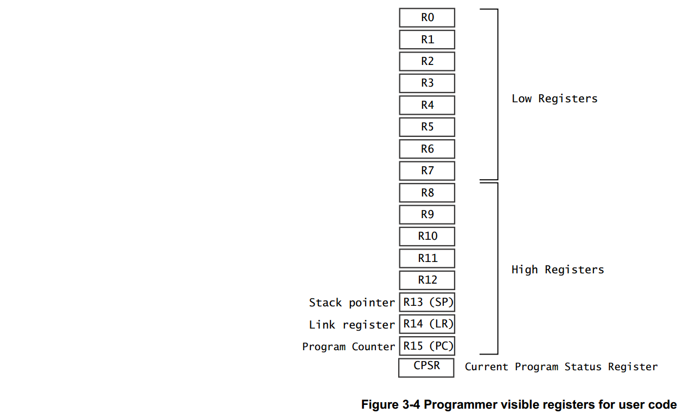
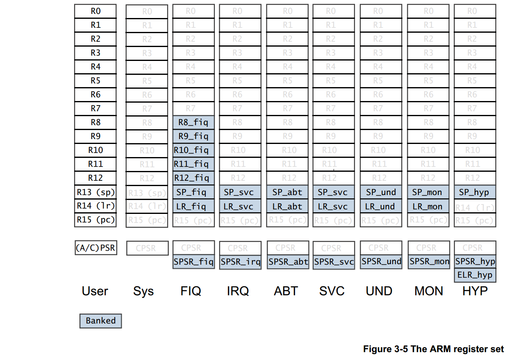

## 寄存器

ARM 架构为软件使用提供 16 个 32-bit 通用目的寄存器\(R0-R15\)。其中 15 个\(R0-R14\)能用于通用目的存储，而 R15 是程序计数器，其值随着核心执行指令而改变。通过软件显式更改 R15 将会改变程序流，软件也能可以访问 CPSR，和一个之前模式的保存副本，这个存于寄存器 Saved Program Status Register\(SPSR\)。虽然软件能够访问寄存器，但这依赖于软件执行的权限等级和模式和被访问的寄存器，一个名字的寄存器可以对应不同的物理存储位置，这就被称为 BANK， Figure 3-5 中阴影部分就被 banked。他们用物理上不同的存储位置来区别，并且通常只有当一个特定的模式下才能访问到这个特定的储存位置。在所有模式中，'Low Registers' 和 R15 共享相同的物理地址。从 Figure 3-5 可以看到一些 'High Registers' 在一些特定模式下 banked。例如 R8-R12 就在 FIQ 模式下 banked 了，因此访问他们实际上是不同的物理存储位置。对于除了用户和系统模式以外的所有模式，R13 和 SPSR 也是被 banked 的。

在被 banked 的寄存器中，软件通常并不指定寄存器访问的实例，而是隐式地决定访问哪个实例。例如，一个在用户模式执行的程序若要访问 R13 的话则会指定访问 R13\_usr_。_一个在 SVC 模式下执行的程序若要访问 R13 则会则定访问 R13\_svc。

R13 （在所有模式下）都是 OS 栈指针，但是在不需要栈指针操作的时候也可以用作一个通用目的寄存器。

R14 （the Link Resiter）保存当你使用一个分支链接\(Branch Link\)指令进入的子程序的返回地址。当不需要提供从子程序的返回值时这个寄存器也可以当做通用目的寄存器使用。R14\_svc、R14\_irq、R14\_fiq、R14\_abt 和 R14\_und 同样被用来保存当中断和异常抛出时，或者是在中断和异常程序运行中分支链接指令被执行时 R15 寄存器返回的值。

R15 是程序计数器，用于保存现在程序地址（事实上，他总是指向 ARM 状态下的当前指令的前 8 bytes 和 Thumb 状态下的当前指令的 4 bytes，这是最初 ARM1 处理器三阶段管道的遗留物）。当 R15 在 ARM 状态下被读取时，bits \[1:0\] 是 0 并且 bits \[31:2\] 包含 PC。在 Thumb 状态下被读取时，bit \[0\] 总是读成 0 。

R0-R14 的复位值是不可预测的，SP\(the stack pointer\)必须在使用栈之前由启动代码初始化。ARM Architecture Procedure Call

Standard \(AAPCS\) 或者 ARM Embedded ABI \(AEABI\)（见于第十五章应用二进制接口）指定软件应如何使用通用寄存器以便在不同的工具链或编程语言之间进行互操作。

### Hypervisor mode

支持虚拟化扩展的实现在 Hypervisor\(Hyp\) 模式下拥有额外的寄存器。超特权模式在 PL2 权限级别上运行。它可以访问自己版本的 R13\(SP\) 和 SPSR。它使用用户模式链接寄存器存储函数返回地址，并有一个专用寄存器 ELR\_hyp 来存储异常返回地址。Hyp 模式仅在非安全模式下可用，并提供虚拟化工具，这些工具只能在这种模式下访问。有关更多信息，请参阅第二十二章虚拟化。

### Program Status Registers

在任何时候，你都可以访问 16 个寄存器\(R0-R15\)和 Current Program Status Register\(CPSR\)。在用户模式下，可以访问一个受限的 CPSR 表单，称为应用程序状态寄存器\(APSR\)。

使用当前程序状态寄存器\(CPSR\)存储：

* APSR flags.
* current processor mode.
* Interrupt disable flags.
* The current processor state, that is, ARM, Thumb, ThumbEE, or Jazelle.
* The endianness.
* Execution state bits for the IT block.

程序状态寄存器\(PSR\)形成一组额外的 bank 寄存器。每个异常模式都有自己的保存程序状态寄存器\(SPSR\)，当异常发生时，会自动存储前异常CPSR的副本。这些不能从用户模式中访问。

应用软件程序员必须使用 APSR 访问非特权模式下可以更改的 CPSR 部分。APSR 只能用于访问 N、Z、C、V、Q 和 GE\[3:0\] 位。这些位通常不是直接访问的，而是通过条件代码设置指令进行设置，并通过有条件执行的指令进行测试。

例如，`CMP R0，R1`指令比较 R0 和 R1 的值，如果 R0 和 R1 相等，则设置 0 标志\(Z\)。

Figure 3-6 显示了 CPSR 中的位分配。每个位表示如下:

* N – Negative result from ALU.
* Z – Zero result from ALU.
* C – ALU operation Carry out.
* V – ALU operation oVerflowed.
* Q – cumulative saturation \(also described as sticky\).
* J – indicates whether the core is in Jazelle state.
* GE\[3:0\] – used by some SIMD instructions.
* IT \[7:2\] – If-Then conditional execution of Thumb-2 instruction groups.
* E bit controls load/store endianness.
* A bit disables asynchronous aborts.
* I bit disables IRQ.
* F bit disables FIQ.
* T bit – indicates whether the core is in Thumb state.
* M\[4:0\] – specifies the processor mode \(FIQ, IRQ, as described in Table 3-1\).

使用直接写入 CPSR mode bit 的指令，核心就可以在模式之间改变。更常见的是，处理器会因为异常事件而自动改变模式。在用户模式中，你不能操作控制处理器模式的 PSR 位 \[4:0\] 或控制要启用或禁用异常的 A、I 和 F 位。

我们将在第五章和第十一章更详细地讨论这些细节。

### Coprocessor 15

CP15 是系统控制协处理器，它提供了对核心的许多特性的控制。它可以包含 16 个 32位 的主寄存器。对 CP15 的访问受权限控制，并不是所有寄存器都在用户模式下可用。CP15 寄存器访问指令指定所需的主寄存器，指令中的其他字段用于更精确地定义访问并增加 CP15 中的物理 32 位寄存器的数量。CP15 中的 16 个主寄存器被命名为 c0 到 c15，但通常按名称引用。例如，CP15 System Control Register 称为 CP15. SCTLR。

下表总结了 Cortex-A 系列处理器中一些更相关的协处理器寄存器的功能。在研究缓存和 MMU 的操作时，我们将更详细地考虑其中的一些内容。

| **Register** | **Description** |
| :--- | :--- |
| Main ID Register \(MIDR\) | Gives identification information for the processor \(including part number and revision\). |
| Multiprocessor Affinity Register \(MPIDR\) | Provides a way to uniquely identify individual cores within a cluster. |
| **CP15 c1 System Control registers** |  |
| System Control Register \(SCTLR\) | The main processor control register \(see System control register \(SCTLR\)\) |
| Auxiliary Control Register \(ACTLR\) | IMPLEMENTATION DEFINED. Implementation specific additional control and configuration options. |
| Coprocessor Access Control Register \(CPACR\) | Controls access to all coprocessors except CP14 and CP15. |
| Secure Configuration Register \(SCR\) | Used by TrustZone \(Chapter 21\) |
| **CP15 c2 and c3, memory protection and control registers** |  |
| Translation Table Base Register 0 \(TTBR0\) | Base address of level 1 translation table \(see Chapter 9\) |
| Translation Table Base Register 1 \(TTBR1\) | Base address of level 1 translation table \(see Chapter 9\) |
| Translation Table Base Control Register \(TTBCR\) | Controls use of TTB0 and TTB1 \(see Chapter 9\). |
| **CP15 c5 and c6, memory system fault registers** |  |
| Data Fault Status Register \(DFSR\) | Gives status information about the last data fault \(see Chapter 11\). |
| Instruction Fault Status Register \(IFSR\) | Gives status information about the last instruction fault \(see Chapter 11\). |
| Data Fault Address Register \(DFAR\) | Gives the virtual address of the access that caused the most recent precise data abort \(see Chapter 11\). |
| Instruction Fault Address Register \(IFAR\) | Gives the virtual address of the access that caused the most recent precise prefetch abort \(see Chapter 11\). |
| **CP15 c7, cache maintenance and other functions** |  |
| Cache and branch predictor maintenance functions | See Chapter 8 |
| Data and instruction barrier operations | See Chapter 10 |
| **CP15 c8, TLB maintenance operations** |  |
| **CP15 c9, performance monitors** |  |
| **CP15 c12, Security Extensions registers** |  |
| Vector Base Address Register \(VBAR\) | Provides the exception base address for exceptions that are not handled in Monitor mode. |
| Monitor Vector Base Address Register \(MVBAR\) | Holds the exception base address for all exceptions that are taken to Monitor mode. |
| **CP15 c13, process, context and thread ID registers** |  |
| Context ID Register \(CONTEXTIDR\) | See description of ASID Chapter 9\). |
| Software thread ID registers | See description of ASID Chapter 9\). |
| **CP15 c15, IMPLEMENTATION DEFINED registers** |  |
| Configuration Base Address Register \(CBAR\) | Provides a base address for the GIC and Local timer type peripherals. |

所有系统架构功能都是通过从协处理器 15 中的一组寄存器\(CRn\)中读取或写入通用处理器寄存器\(Rt\)来控制的。指令的 Op1、Op2 和 CRm 字段也可以用来选择寄存器或操作。格式如 Example 3-1 所示。我们不会详细介绍各种 CP15 寄存器，因为这会与 _ARM Architecture Reference  
 Manual_ 或产品文档中容易获得的参考信息重复。

作为如何从这些寄存器中读取信息的示例，我们将考虑只读主 ID 寄存器\(MIDR\)，其格式如 Figure 3-7 所示。在特权模式下，我们可以使用下面指令读取这个寄存器：

`MRC p15, 0, R1, c0, c0, 0`

并把结果放入寄存器 R1 中，这样就告诉软件它正在运行的处理器。对于 ARM Cortex 处理器，编译结果如下：

* Bits \[31:24\] – implementer, will be 0x41 for an ARM designed processor.
* Bits \[23:20\] – variant, shows the revision number of the processor.
* Bits \[23:20\] – variant, shows the revision number of the processor.
* Bits \[19:16\] – architecture, will be 0xF for ARM architecture v7.
* Bits \[15:4\] – part number, for example 0xC08 for the Cortex-A8 processor.
* Bits \[3:0\] – revision, shows the patch revision number of the processor.

### System control register \(SCTLR\)

SCTLR 是另一个使用 CP15 访问的寄存器，它控制标准内存、系统设施，并为核心中实现的功能提供状态信息。

系统控制寄存器只能从 PL1 或更高特权访问。每个位表示如下:

* TE – Thumb exception enable. This controls whether exceptions are taken in ARM or
   Thumb state.
* NMFI – Non-maskable FIQ \(NMFI\) support. See Chapter 12.
* EE = Exception endianness. This defines the value of the CPSR.E bit on entry to an
   exception. See Chapter 14.
* U – Indicates use of the alignment model. See Chapter 14.
* FI – FIQ configuration enable. See Chapter 12.
* V – This bit selects the base address of the exception vector table. See Chapter 11,
* I – Instruction cache enable bit. See Example 3-2 on page 3-13 and Invalidating and
   cleaning cache memory on page 8-17.
* Z – Branch prediction enable bit. See Example 3-2 on page 3-13 and Invalidating and
   cleaning cache memory on page 8-17
* C – Cache enable bit. See Example 3-2 on page 3-13 and Invalidating and cleaning cache
   memory on page 8-17
* A – Alignment check enable bit. See Chapter 14.
* M – Enable the MMU. See Chapter 9.

启动代码序列的一部分通常是在 CP15 中设置 SCTLR 的 Z 位用于进行分支预测。执行此操作的代码序列显示在下面这个例子 Example 3-2。这个代码的类似形式可以在 Page 13-3 的 Example 13-3 中找到。

