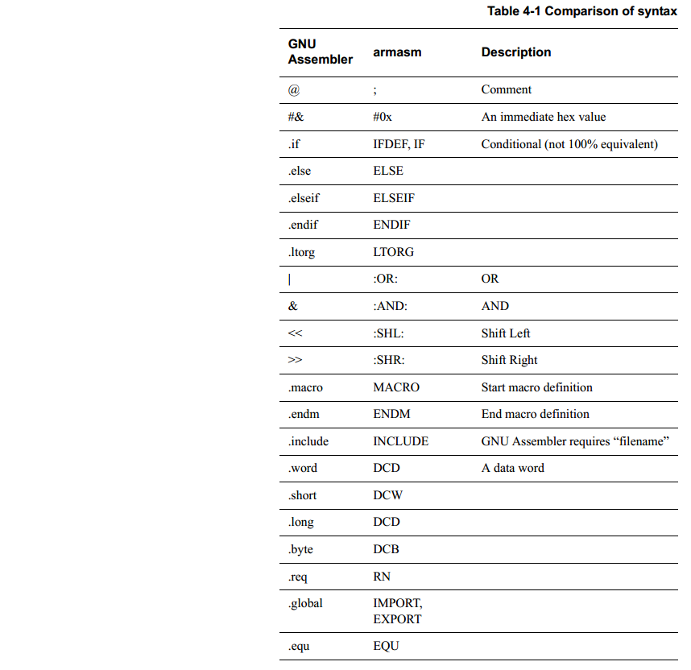

## GNU 汇编器简介

GNU 汇编器作为 GNU 工具的一部分是用于将汇编语言编写的代码转换成二进制目标文件。汇编器文档写于 GNU 汇编手册（GNU Assembler Manual）并且可以在 [http://sourceware.org/binutils/docs/as/index.html](http://sourceware.org/binutils/docs/as/index.html ) 网上阅读或在 `gnutools/doc` 子文件夹内（当然你得在你的系统中安装 GNU 工具）。GNU 汇编器文档同样可以在 Ubuntu 系统的 `/gcc-doc/` 包中阅读。

下面是一个简短的描述，旨在强调 GNU 汇编器和标准 ARM 汇编语言之间的语法差异，并提供足够的信息让程序员开始使用这些工具。

GNU 工具组件的名称都带有前缀，用来表明所选的目标选项，包括操作系统。例如 `arm-none-eabi-gcc`，它被 ARM EABI 的裸金属系统所使用。

### 调用 GNU 汇编器

你可以通过运行 `arm-none-eabi-as` 程序来汇编 ARM 汇编语言源文件的内容。

`arm-none-eabi-as -g -o filename.o filename.s`

选项 `-g` 请求汇编程序在输出文件中包含调试信息。

当你的所有源文件都汇编成二进制对象文件\(扩展名为 `.o`\)时，您可以使用 GNU 链接器以 ELF 格式创建最终的可执行文件。

这可以由下面的代码完成：

`arm-none-eabi-ld -o filename.elf filename.o`

对于更复杂的程序，当有许多分开的源文件使用程序例如 `make` 来控制构建过程是更常用的。

你也可以使用由 `arm-none-eabi-gdb` 或者 `arm-none-eabi-insight` 提供的调试程序来在主机上运行可执行文件，以替代一个整整的目标核。

### GNU 汇编语法

GNU 汇编器能用于许多不同的处理器架构而不仅仅是特指 ARM，这就意味着它的语法在某些地方会与 ARM 汇编器有所不同，就比如 ARM 工具链。GNU 汇编器对于所有的他所支持的处理架构所用的语法都是相同的。

汇编语言源文件包括一系列语句，每一句一行。

每一个语句都有三个可选部分，并按下面顺序排列：

`label: instruction @ comment`

`label` 让你定义这条指令的地址，可用作分支指令或加载和存储指令的目标。标签可以是一个字母，后面可跟着（可选地）一系列字母数字字符，后面跟着一个冒号。

`instruction` 可以是 ARM 汇编指令，也可以是汇编器指令。这些伪指令告诉汇编程序自己要做什么。指令在三个部分中是最必须的，是控制部分和对齐或创建数据所必需的。

每个在 `@` 符号后边的被看做是一个注释并且可被忽略（除非在字符串当中）。C 语言中的注释 "`/**/`" 也能被使用。

如果源代码中没有显式地提供入口点，则可以在命令行中指定入口点。

### 节

一个带有代码的可执行程序至少有一个部分，按照惯例，这个部分称为 `.text`。数据可以包含在 `.data` 部分中。

具有相同名称的指令使你能够指定这两个部分中的哪一部分用于保存源文件中接下来的内容。可执行代码应该出现在 `.text` 部分中，并在 `.data` 部分中读写数据。此外，只读常量也可以出现在 `.rodata` 部分。0 初始化的数据将出现在 `.bss` 中。由 Block Started by Symbol \(bss\) 段定义未初始化静态数据的空间。

### 汇编器指令

这是 GNU 工具和其他汇编语言之间的一个关键区别。

所有汇编指令都以点开头。GNU 文档中描述了完整的列表。在这里，我们给出一个常用指令的子集。

`.align`

这条指令令汇编器用 0 值在 data section 或 NOP 指令代码填充二进制文件，以确保下一个位置将在一个字边界。`.align n` 在 ARM 内核中进行 2 的 n 次方对齐。

`.ascii` "string"

这个指令按照指定的方式将字符串文本插入到对象文件中，而且不需要终止 NUL 字符。可以使用逗号作为分隔符指定多个字符串。

`.asciiz`

执行与 `.ascii` 相同的操作，但这一次后面是 NUL 字符\(值为0\(0\)的字节\)。

`.byte expression`, `.hword expression`, `.word expression`

向目标文件插入一个字节，半字或者一个字。可以使用逗号作为分隔符指定多个值。与半字和字的同义词 `.2byte` 和 `.4byte` 也可以用。

`.data`

将接下来的语句放置在最终可执行文件的数据部分。

`.end`

标记源文件的最后部分，汇编器不再处理这个标记点后的任何语句。

`.equ` _**symbol**_, expression

将 _**symbol **_值置于 expression，“=” 符号和 `.set` 有相同的效果。

`.extern` _**symbol **_

表明 _**symbol **_是在别的源文件中定义的。

`.global` _**symbol **_

告诉汇编器 _**symbol **_对其他源文件和链接器可见。

`.include` “filename”

将 _filename _的内容插入现在的源文件，而且常被用于包括包含共享定义的头文件。

`.text`

把这后边的语句目的地切换到最终输出对象文件的文本部分。汇编指令必须始终在文本部分。

Table 4-1 显示了 GNU 和 ARM 工具的通用汇编指令，以供参考，但并不是所有的指令都被列出，在某些情况下，它们之间并没有 100% 的对应。

### 表达式

汇编指令和汇编器指令通常需要一个整数操作数。在汇编器中，这表示为要计算的表达式。通常，这将是用十进制、十六进制（前缀为 _0x_）或二进制（前缀为 _0b_）指定的整数，或用单引号括起来的 ASCII 字符。

此外，汇编器还可以对标准的数学和逻辑表达式进行求值，以生成一个常数值。它们可以利用标签和其他预定义的值。这些表达式要么产生绝对值，要么产生相对值。绝对值是与位置无关的常数。相对值是相对于某些链接定义的地址指定的，这些地址是在生成可执行映像时确定的——例如分支的目标地址。

### GNU 工具命名约定

寄存器在 GCC 中命名如下：

* 通用寄存器：R0 - R15
* 栈指针寄存器：SP \(R13\)
* 帧指针寄存器：FP \(R11\)
* 链接寄存器：LR \(R14\)
* 程序计数器：PC \(R15\)
* 程序状态寄存 flags：_x\_\_PSR_, x\_\_PSR\_all_, x\_\_PSR\_f_, x\_\_PSR\_x, \_x_\_PSR\_ctl, _x_\_PSR\_fs, _x\_\_PSR\_fx_, x\_\_PSR\_f_, x_\_PSR\_cs_, x_\_PSR\_cf_, x_\_PSR\_cx（其中 \_x\_ = C（当前）或 S（保存）），详情见第三章。

\_\_\_\_\_\_\_\_\_\__**Note**_\_\_\_\_\_\_\_\_\_\_\_

第十五章描述如何描述如何在过程调用标准中分配所有寄存器的角色，以及 GNU 汇编程序如何让你使用它们的过程调用标准名称引用寄存器\(_Procedure Call Standard_ \(PCS\) \)。详情见 Table15-1 第十五章。

\_\_\_\_\_\_\_\_\_\_\_\_\_\_\_\_\_\_\_\_\_\_\_\_\_\_

