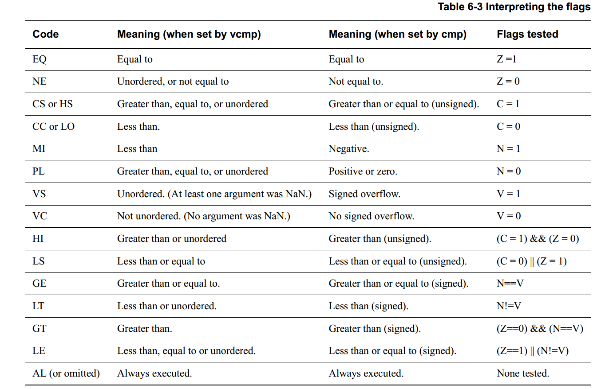

## 浮点基础和 IEEE-754 标准

IEEE-754 标准是几乎所有现代计算机浮点数学实现的参考，包括 ARM 浮点系统。最初的 IEEE-754-1985 标准已经随着 IEEE-754-2008 的发布而更新。该标准精确地定义了每个基本浮点操作对所有可能的输入值所产生的结果。它描述了一个兼容的实现应该如何处理无法精确表达的四舍五入结果。一个简单的例子的计算就是 1.0÷3.0，这需要无限小数的数字表达精确的数量或二进制符号。

IEEE-754 提供了许多不同的舍入选项来处理这个问题\(四舍五入到正无穷，四舍五入到负无穷，四舍五入到零，以及两种形式的四舍五入到最近，请参阅第六章中的舍入算法\)。IEEE-754 还指定异常操作发生时的结果。这意味着计算可能代表一个问题。可以通过查询 FPSCR \(在 ARM 处理器上\)或设置陷阱处理程序\(在某些系统上\)来测试这些条件。异常操作的例子如下:

**Overflow** 结果太大以至于无法表示

**Underflow** 结果太小以至于精确度缺失

**Inexact** 不缺失精确度的话结果不能被表示，显然许多浮点计算结果会处于这个分类

**Invalid** 例如，尝试计算一个负数的平方根

**Division by zero**

该规范还描述了在检测到这些异常操作之一时必须采取的操作。可能的结果包括生成无效操作的非数字 \(NaN\) 结果、正无穷大或负无穷大、溢出或除零，或在下溢出的情况下 denormalized 数字。该标准还定义了如果后续浮点运算仍要对 NaN 或 infinities 运算，应该产生什么结果。

IEEE-754 定义的一件事是如何在硬件中表示浮点数。浮点数通常使用单精度 \(32位\) 或双精度 \(64位\) 表示。VFP\(参见第二章的 VFP\)支持硬件中的单精度 \(32位\) 和双精度 \(64位\) 格式。此外，VFPv3 可以有半精度的扩展来支持 16 位值用于存储。

浮点格式使用可用空间存储关于浮点数的三段信息:

* 一个符号位 \(S\) 表明是正数（0）还是负数（1）
* 指数给出其数量级的指数
* 一个尾数，给出数字的小数部分的二进制数字

例如，对于单精度浮点数，word 的比特 \[31\] 是符号位\[S\]，位 \[30:23\] 给出指数，位 \[22:0\] 给出尾数。参见 Figure 6-1。

数的值是 ±m 乘以 2 的 exp 次方。其中 m 来源于尾数，exp 来源自于指数。尾数不是直接取 23 位的二进制值生成的，而是取决于小数点的位置，从左边是 1 的右边开始。换句话说，二进制尾数必须大于或等于1，小于2。在数字为 0 的情况下，通过将所有的指数和尾数位设置为 0 来表示。对于正无穷和负无穷以及 not-a-number \(NaN） 值，还有其他的特殊情况表示。另一个特例是 denormalized 去规范化值。

符号位允许你区分正无穷和负无穷和 NaN 表示。类似地，8 位的指数值用于给出一个范围在 +128 到 -127 之间的值，因此在编码中隐含了 -127 的偏移量。Table 6-1 总结了这一点。让我们考虑这样一个例子：

十进制值 +0.5 用 16 进制值 0x3F000000 表示为一个精确浮点数。它的符号值为 0\(正\)。

尾数的值是 1.0，不过整数部分 \(1\) 是隐式的，不存储。指数值用位 \[30:23\] 表示，为 0b01111110，或 126 - 127 来表示指数 -1。

结果因此是denormal 数是一个特例。如果你把指数位设为 0，你可以通过设置尾数位来表示除 0 之外的非常小的数。因为正常的数值有一个隐含的领先 1，最接近零值可以表示为一个正常的值是 ±2 的 -126。

为了得到更小的数，1.m 对尾数值的解释被替换为 0.m 的解释。现在，数字的大小只由位位置决定。当使用这些极小的数字时，可用的精度不会随值的大小而变化。如果没有附加到尾数上的隐含 1，则最低位左边的所有位都是前导零，因此最小的可表示数是 1.401298464e-45，用 0x00000001 表示。

由于性能原因，这些异常值常常被忽略，并被刷新为零。这完全违反了 IEEE-754，但是在实际程序中很少使用异常值，因此性能优势比正确处理这些极小的数字更有价值。带 VFP 的 Cortex 处理器使代码能够在 flushto -zero 模式和 full denormal support 之间进行选择。

因为一个 32 位浮点数有一个 23 位的尾数，所以有许多 32 位整数的值，如果转换为 32 位浮点数，就不能精确地表示出来。这就是所谓的精度损失。如果您将这些值中的一个转换为 float 并返回 int，您将得到一个不同的但邻近的值。在双精度浮点数的情况下，指数字段有 11 位\(指数范围从 -1022 到 +1023\)，尾数字段则有52位。

### 舍入算法

IEEE 754-1985 标准定义了四种四舍五入的结果方式，如下所示:

* Round to nearest \(ties to even\). This mode causes rounding to the nearest value. If a
   number is exactly midway between two possible values, it is rounded to the nearest value
   with a zero least significant bit
* Round toward 0. This causes numbers to always be rounded towards zero \(this can be also
   be viewed as truncation\)
* Round toward +∞ .This selects rounding towards positive infinity
* Round toward -∞. This selects rounding towards negative infinity

IEEE 754-2008 标准增加了一个额外的舍入模式。在四舍五入到最近的情况下，现在也可以四舍五入正好在两个值之间，远离零\(换句话说，正数向上，负数向下\)。这是在将其四舍五入到最小有效位为零的最近值的选项之外的另一个选项。目前 VFP 不支持这种舍入模式。

### ARM VFP

VFP 是 ARMv7-A 体系结构中指令集的可选扩展，但很少被忽略。它可以在 32 个或 16 个双字寄存器中实现。术语 VFPv3-D32 和 VFPv3-D16 用于区分这两个选项。如果 高级 SIMD \(NEON\) 扩展是与 VFPv3 一起实现的，那么 VFPv3- d32 总是存在的。VFPv3 还可以通过提供半精度浮点数\(16位\)和单精度浮点数\(32位\)之间双向转换函数的半精度扩展进行可选扩展。这些操作只允许在其他格式之间转换半精度浮点数。

VFPv4 为 VFPv3 的特性添加了半精度扩展和融合的多重添加指令。在融合的多重加法操作中，最后只出现一个四舍五入。这是 IEEE 754-2008 规范的一个新方面。融合运算可以提高重复积累乘积的计算精度，如矩阵乘法或点积运算。由个别 Cortex-A 系列处理器支持的 VFP 版本在第二章的 Table 2-3 中给出。

除了描述的寄存器外，还有许多其他 VFP 寄存器:

**Floating-Point System ID Register \(FPSID\)**

系统软件可以读取这些信息，以确定硬件中支持哪些浮点特性。

**Floating-Point Status and Control register \(FPSCR\)**

这保存了比较结果和异常标志。控件位选择舍入选项并启用浮点异常捕获。

**Floating-Point Exception Register \(FPEXC\)**

FPEXC 寄存器包含允许处理异常以确定发生了什么情况的系统软件的位。

**Media and VFP Feature registers 0 and 1 \(MVFR0 and MVFR1\)**

这些寄存器使系统软件能够确定在处理器实现上提供了哪些高级 SIMD 和浮点特性。

用户模式代码只能访问 FPCSR。这意味着应用程序不能读取 FPSID 来确定支持哪些特性，除非宿主操作系统提供这些信息。例如，Linux 通过 /proc/cpuinfo 提供了这些信息，但是这些信息远不如 VFP 硬件寄存器提供的详细。

与 ARM integer 指令不同，VFP 操作不会直接影响 APSR 中的标志。标志存储在 FPSCR 中。在整数处理器可以使用浮点比较结果之前，浮点比较设置的标志必须使用 VMRS 指令转移到 APSR。这包括使用进行条件执行的标志，甚至其他VFP指令。

Example 6-1 展示了一段简单的代码来说明这一点。VCMP 指令对 VFP 寄存器 d0 和 d1 中的值进行比较，从而设置 FPSCR 标志。然后，必须使用 VMRS 指令将这些标志转移到整数处理器 APSR。然后，您可以基于此有条件地执行指令。**Flag meanings**

整数比较标志不支持浮点数的比较。例如，浮点值总是有符号的，因此不需要进行无符号比较。另一方面，浮点数比较可能导致无序结果\(意味着一个或两个操作数都是 NaN，或者不是一个数字\)。IEEE-754 定义了两个浮点值之间的四个可测试关系，这些关系映射到 ARM 条件代码，如下所示：**Compare with zero**

与整数指令不同，大多数 VFP\(和 NEON \)指令只能在寄存器上运行，不能接受指令流中编码的立即值。VCMP 指令是一个值得注意的例外，因为它有一个特殊情况的变体，支持与零进行快速和简单的比较。

**Interpreting the flags**

当标志在 APSR 中，它们几乎可以被使用，就像一个整数比较设置了标志一样。然而，浮点比较支持不同的关系，因此整数条件代码并不总是有意义的。Table 6-3 描述了浮点比较而不是整数比较：很明显，条件代码附加到读取标记的指令上，标记的来源与测试的标记没有区别。执行 vcmp 而不是 cmp 时，标志的含义不同。同样，很明显，相反的条件仍然存在。例如，HS 仍然与 LO 相反。

当被 CMP 设置时，这些标志通常具有类似于 VCMP 设置的标志的含义。例如，GT 仍然表示大于。然而，无序条件和删除有符号条件可能会混淆问题。例如，经常需要使用 LO，通常是一个 unsigned less than check，来代替 LT，因为它在无序的情况下不匹配。

### 开启 VFP

如果 ARMv7-A 内核包含 VFP 硬件，那么在应用程序使用它之前必须显式启用它。要做到这一点，需要几个步骤：

* 必须设置 FPEXC 寄存器中的 EN 位。
* 如果在 Normal World 下需要访问 VFP，那么必须在 Non-Secure Access Control Register \(CP15.NSACR\) 中启用对 CP10 和 CP11 的访问。这通常是在安全引导加载程序中完成的。
* 在 Coprocessor Access Control Register \(CP15.CACR\) 中必须启用对 CP10 和 CP11 的访问。这可以由操作系统根据需要完成。

