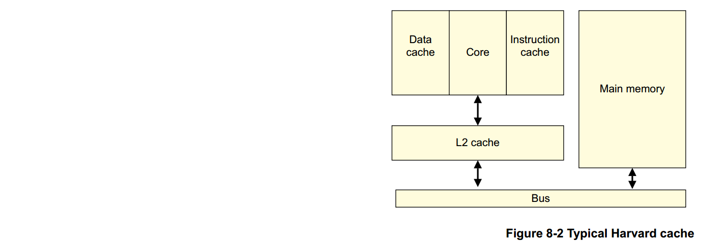

## 内存层次架构

在计算机科学中，内存层次结构指的是内存类型的层次结构，更快、更小的内存靠近内核，而更慢、更大的内存则离内核更远。在大多数系统中，您可以拥有辅助存储(如磁盘驱动器)和主存储(如闪存、SRAM 和 DRAM)。在嵌入式系统中，通常将其细分为片内存储器和片外存储器。在同一个芯片(或者至少在同一个包中)作为核心的内存通常要快得多。

缓存可以包含在层次结构中的任何级别，并且可以在内存系统的不同部分之间存在访问时间差的情况下提高系统性能。

在基于 ARM 处理器的系统中，一级(L1)缓存通常直接连接到核心逻辑，核心逻辑获取指令并处理加载和存储指令。这些是 Harvard 缓存，也就是说，有单独的缓存用于指令和数据，这些数据有效地作为核心的一部分出现。

多年来，由于 SRAM 的大小和速度的提高，L1 缓存的大小增加了。在编写本文时，16KB 或 32KB 的缓存大小是最常见的，因为这些是能够以 1GHz 或更高的核心速度提供单周期访问的最大 RAM 大小。

此外，许多 ARM 系统都有二级(L2)缓存。这比 L1 缓存大(通常为 256KB、512KB 或 1MB)，但速度慢且统一(同时保存指令和数据)。它可以位于内核本身内部，也可以作为外部块实现，位于内核和内存系统的其余部分之间。ARM L2C-310 就是这种外部 L2 缓存控制器块的一个例子。

此外，核心可以在集群(clusters)中实现，每个核心都有自己的一级缓存。这样的系统需要一些机制来维护缓存之间的一致性，这样当一个内核更改内存位置时，共享内存的其他内核就可以看到这种更改。当我们研究多核处理器时，会更详细地描述这一点。

