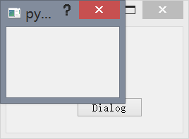

## QDialog 的简单示例

在这一小节，我们使用面向对象的方法对上一小结进行重写，并加入简单 `QDialog` 的示例。

例 2-2：`MyQDialog.pyw`
```python
import sys
from PyQt5.QtCore import *
from PyQt5.QtGui import *
from PyQt5.QtWidgets import *

class MyQWidget(QWidget):
    def __init__(self,parent = None):
        super(MyQWidget,self).__init__(parent)
        self.initUi()

    def initUi(self):
        self.resize(250,150)
        self.move(300,300)
        self.setWindowTitle("MyQWidget")
        self.button = QPushButton("Dialog",self)
        self.button.move(100,100)
        self.button.clicked.connect(self.show_Dialog)
        self.dialog = QDialog()        self.dialog.setModal(True)
        self.dialog.resize(150,100)
        self.dialog.move(300,300)

    def show_Dialog(self):
        self.dialog.show()

if __name__ is "__main__" :
    app = QApplication(sys.argv)
    mywindow = MyQWidget()
    mywindow.show()
    sys.exit(app.exec_())
```

面向对象编程中的三件重要的事情就是类、数据和方法。这里我们创建了一个新类 `MyQWidget`，它是由 `QWidget` 继承而来。这就意味着我们可以调用两个构造方法，第一个是 `MyQWidget` 的，另外一个则是他的继承类。这个 `super()` 方法返回父类对象，`MyQWidget` 调用它的构造方法。该 `__init__()` 方法是 python 语言中的构造函数。

构造方法写好之后使用 `initUi()` 方法进行初始化用户界面。其中初始化的方法和上一个小节中的方法一致，不再一一说明，其中创建了一个新的控件 `QPushButton`，这个控件是一个简单的按钮，通过 `move()` 方法可以将按钮移动到以窗口左上角为坐标原点的参数坐标位置，最后利用信号槽机制将按钮点击事件与函数 `show_Dialog` 联系起来，这样当按钮点击以后将会触发这个函数。信号槽机制在本章第 4 节会详细讲解。

此外，还创建了一个最简单的 `QDialog` 对象。这个对象在触发 `show_Dialog` 函数以后将被显示出来。在被显示出来之前，首先先设置好该对话框的一些性质，比如位置大小模式等等。

最终程序通过入口 `if __name__ is "__main__"` 开始执行，首先创建一个 `MyQWidget` 对象，然后在显示出来，最终循环结束退出。

我们同样放出程序运行的结果：


