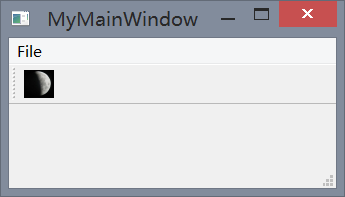

## QMainWindow 的简单示例

这一小节我们简单介绍一下 `QMainWindow` 类，我我们看下面这个例子。

例 2-3：`MyQMainWindow.pyw`
```python
import sys
from PyQt5.QtCore import *
from PyQt5.QtGui import *
from PyQt5.QtWidgets import *

class MyMainWindow(QMainWindow):
    def __init__(self,parent = None):
        super(MyMainWindow,self).__init__(parent)
        self.initUI()

    def initUI(self):
        self.resize(100,150)
        self.setWindowTitle("Ready")
        exit = QAction(QIcon('test2.png'), 'Exit', self)
        exit.setShortcut('Ctrl+Q')
        exit.setStatusTip('Exit application')
        exit.triggered.connect(self.close)

        self.statusBar()
        toolbar = self.addToolBar("Exit")
        toolbar.addAction(exit)

        menubar = self.menuBar()
        file = menubar.addMenu("&File")
        file.addAction(exit)

if __name__ is "__main__" :
    app = QApplication(sys.argv)
    mywindow = MyMainWindow()
    mywindow.show()
    sys.exit(app.exec_())
```

`QMainWindow` 最突出的特点就在于它的工具栏、状态栏和菜单栏，这个例子则将三者简单的汇总到了一起。

同样我们创建了一个类 `MyQMainWindow`，这个类先用父类的构造方法，再构造自己的 Ui，首先定义窗口名称和窗口大小，然后创建了一个 `QAction` 对象，该对象相当于一个事件，该动作使用一个 `icon`，名为 `Exit`，父对象为该实例，并设置了它的快捷键和状态信息，最后将动作触发通过信号槽机制将其与程序退出绑定。`self.statusBar()` 方法实例化状态栏。

在工具栏中，同样我们还是使用该动作，将该动作加入到了工具栏中。对于菜单栏，首先先实例化一个菜单栏，将该菜单栏加入一个 `File` 菜单，然后在改菜单栏中加入之前定义的动作即可。

对于程序入口，与前面同样不在赘述。我们同样放出程序运行的结果：


