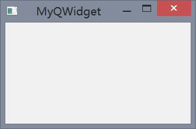

## QWidget 的简单示例

在本章以后的小节中，我们都是先摆出最简单易懂的程序代码，然后再对代码进行解释

在这一个小节中，我们简单介绍一下 PyQt5 中 `QWidget` 类，我们先看下面这个例子

例 2-1：`MyQWidget.pyw`
```python
import sys
from PyQt5.QtCore import *
from PyQt5.QtGui import *
from PyQt5.QtWidgets import *

if __name__ is "__main__" :
    app = QApplication(sys.argv)
    mywindow = QWidget()
    mywindow.resize(250,150)
    mywindow.move(300,300)
    mywindow.setWindowTitle("MyQWidget")
    mywindow.show()
    sys.exit(app.exec_())

```

首先先看导入，导入 `QtCore` 和 `QtGui` 就可以使用其中的函数方法和变量，当然在我们这个简单的小程序之中并没有使用到其中的方法，但是对于以后的程序，写上这两句代码总是有帮助的。而 `QtWidgets` 模块提供了基本的小部件。我们所创建的这个程序也是一个小部件。

学过 python 的人都知道，在面对对象程序中，`if __name__ is "__main__" :` 在 python 中被当做程序的入口。每一个 PyQt5 应用程序都必须创建一个应用程序对象，该 `sys.argv` 参数是来自命令行的参数列表。python 脚本可以以 `shell` 运行。这是我们如何控制脚本启动的一种方法。

```python
mywindow = QWidget()
```
该 QWidget 控件是 PyQt5 中所有其他用户界面对象的基础。我们提供了默认的构造函数 QWidget()。默认的构造函数没有父类。没有父类的控件称为窗口。

```python
mywindow.resize(250,150)
mywindow.move(300,300)
mywindow.setWindowTitle("MyQWidget")
mywindow.show()
```
`resize()` 方法调整了控件的大小，它宽 250px，高 150px。`move()` 方法将窗口控件移动到 x = 300px, y = 300px 的位置。`setWindowTitle()` 方法设置了窗口的标题。最后通过 `show()` 方法在屏幕上显示该控件。控件首先在内存创建，然后在屏幕上显示。

```python
sys.exit(app.exec_())
```
最后我们进入应用程序的主循环。事件处理从这一点开始。主循环接受来自窗口系统的事件，并将它们分派给应用程序控件，主循环结束，如果我们调用 `exit()` 方法，或者主控件被销毁。该 `sys.exit()` 方法确保干净的退出。环境将被告知程序如何结束。该 `exec_()` 方法有一个下划线，这是因为 `exec` 是 python 的关键字。因此用 `exec_()` 来替代。

执行该段代码最终创建了下面这个程序：

