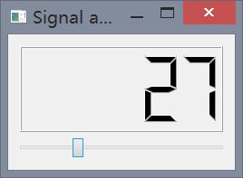

## 信号和槽

每个 QObject 的一个子类 —— 包括 PyQt 的全部窗口部件，因为它们都派生自 QWidget，这也是 QObject 的一个子类 —— 都会支持信号和槽机制。特别是，它们都有声明状态转换的能力，比如当选中或者不选中复选框 ( checkbox ) 时，或者是其他重要事件发生的时候，例如按钮按下（无论是哪种按下方式）。PyQt 的所有窗口部件都有一系列的预定义信号。

无论信号何时发射，默认情况下，PyQt 都只是简单地将其扔掉！ 要截取一个信号，就必须将它连接到槽上去。在 C++/Qt 中，槽是必须用特殊语法声明的一些方法，不过在 PyQt 中，槽可以是我们想调用的任何东西（比如，任意的函数或者方法），并且在定义的时候也不需要特殊的语法声明。

大部分的窗口部件也都提前预置了一些槽，所以有些时候可以直接把预置的信号与预置的槽相连接，无须做任何事就可以得到想要的行为效果。从这个方面来看，PyQt 要比 C++/Qt 更为灵便些，因为在 PyQt 中可以连接的不仅只有槽，还可以是任何可被调用的对象，且从 PyQt 4.2 以后，还可以向 QObject 中动态添加一些预定义的信号和槽。让我们通过下面的例子，信号和槽 ( Signals and Slots ) 程序，来看看信号和槽是如何实际工作的吧。

### 信号与槽的绑定
我们通过下面这个简单例子看如何将信号与槽函数绑定在一起。

例子 2-4 `sigslot.pyw`
```python
import sys
from PyQt5.QtCore import *
from PyQt5.QtGui import *
from PyQt5.QtWidgets import *

class MyQWidget(QWidget):
    def __init__(self):
        super().__init__()
        self.initUI()

    def initUI(self):
        lcd = QLCDNumber(self)
        sld = QSlider(Qt.Horizontal, self)
        vbox = QVBoxLayout()
        vbox.addWidget(lcd)
        vbox.addWidget(sld)
        self.setLayout(vbox)
        sld.valueChanged.connect(lcd.display)
        self.setGeometry(300, 300, 250, 150)
        self.setWindowTitle('Signal and slot')
        self.show()

if __name__ == '__main__':
    app = QApplication(sys.argv)
    mywindow = MyQWidget()
    sys.exit(app.exec_())
```

该程序创建了两个控件，一个 LCD 显示钟，一个滑动条，并用布局加入到 `QWidget` 中，利用 `sld.valueChanged.connect(lcd.display)` 将滑动条值改变的信号与 LCD 预设的显示槽绑定起来，这样当滑动条的值发生变化，LCD 显示的数字也随之发生变化。

图像如下图所示：



### 自定义信号

看完信号与槽函数的绑定，我们再来看一下如何自己定义信号和槽

例 2-5 `signal.pyw`
```python
import sys
from PyQt5.QtWidgets import *
from PyQt5.QtCore import *
from PyQt5.QtGui import *

class MyMainWindow(QMainWindow):
    closeapp = pyqtSignal()
    def __init__(self, parent=None):
        super(MyMainWindow, self).__init__(parent)
        self.closeapp.connect(self.close_function)

    def mousePressEvent(self,event):
        self.closeapp.emit()

    def close_function(self):
        self.close()

if __name__ == '__main__':
    app = QApplication(sys.argv)
    mywindow = MyMainWindow()
    mywindow.show()
    sys.exit(app.exec_())
```

该程序自定义了一个信号为 `closeapp`，并且当鼠标按下事件发生以后发出信号，并由自定义的槽函数 `self.close_function()` 与其绑定，即当按下按钮，发射信号，槽函数触发，关闭窗口。
