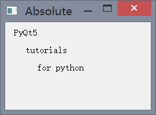

## 代码布局


### 绝对定位

例 5-1：`absolute.py`
```python
import sys
from PyQt5.QtWidgets import *
from PyQt5.QtCore import *
from PyQt5.QtGui import *

class MyQWidget(QWidget):
    def __init__(self):
        super().__init__()
        self.initUI()

    def initUI(self):
        lbl1 = QLabel('PyQt5', self)
        lbl1.move(15, 10)
        lbl2 = QLabel('tutorials', self)
        lbl2.move(35, 40)
        lbl3 = QLabel('for python', self)
        lbl3.move(55, 70)
        self.setGeometry(300, 300, 250, 150)
        self.setWindowTitle('Absolute')
        self.show()

if __name__ == '__main__':
    app = QApplication(sys.argv)
    mywindow = MyQWidget()
    sys.exit(app.exec_())
```


### 框布局

例 5-2：`box.pyw`
```python
import sys
from PyQt5.QtWidgets import *
from PyQt5.QtCore import *
from PyQt5.QtGui import *

class MyQWidget(QWidget):
    def __init__(self):
        super().__init__()
        self.initUI()

    def initUI(self):
        okButton = QPushButton("OK")
        cancelButton = QPushButton("Cancel")

        hbox = QHBoxLayout()
        hbox.addStretch(1)
        hbox.addWidget(okButton)
        hbox.addWidget(cancelButton)

        vbox = QVBoxLayout()
        vbox.addStretch(1)
        vbox.addLayout(hbox)

        self.setLayout(vbox)
        self.setGeometry(300, 300, 300, 150)
        self.setWindowTitle('H and V box')
        self.show()

if __name__ == '__main__':
    app = QApplication(sys.argv)
    mywindow = MyQWidget()
    sys.exit(app.exec_())
```


### 栅格布局
例 5-3：`grid.pyw`
```python
import sys
from PyQt5.QtWidgets import *
from PyQt5.QtCore import *
from PyQt5.QtGui import *

class MyQWidget(QWidget):

    def __init__(self):
        super().__init__()
        self.initUI()

    def initUI(self):
        grid = QGridLayout()
        self.setLayout(grid)

        names = ['Cls', 'Bck', '', 'Close',
                 '7', '8', '9', '/',
                '4', '5', '6', '*',
                 '1', '2', '3', '-',
                '0', '.', '=', '+']

        positions = [(i,j) for i in range(5) for j in range(4)]

        for position, name in zip(positions, names):
            if name == '':
                continue
            button = QPushButton(name)
            grid.addWidget(button, *position)

        self.move(300, 150)
        self.setWindowTitle('Calculator')
        self.show()

if __name__ == '__main__':
    app = QApplication(sys.argv)
    mywindow = MyQWidget()
    sys.exit(app.exec_())
```
